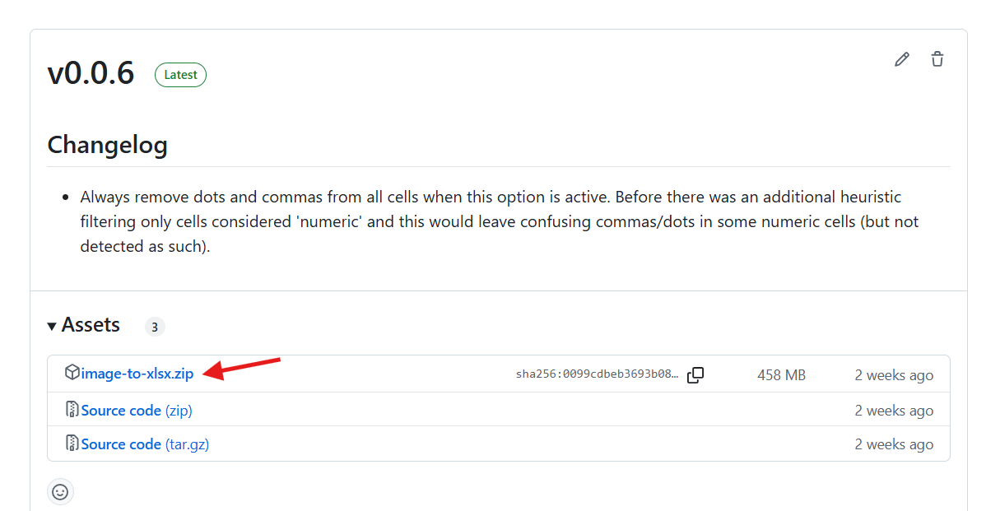
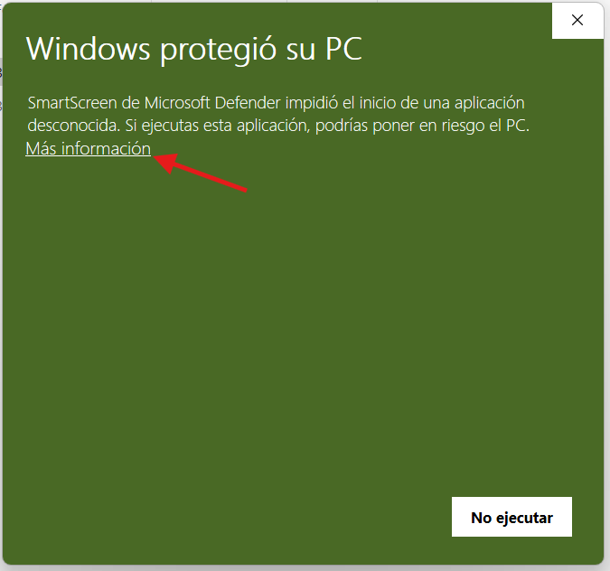
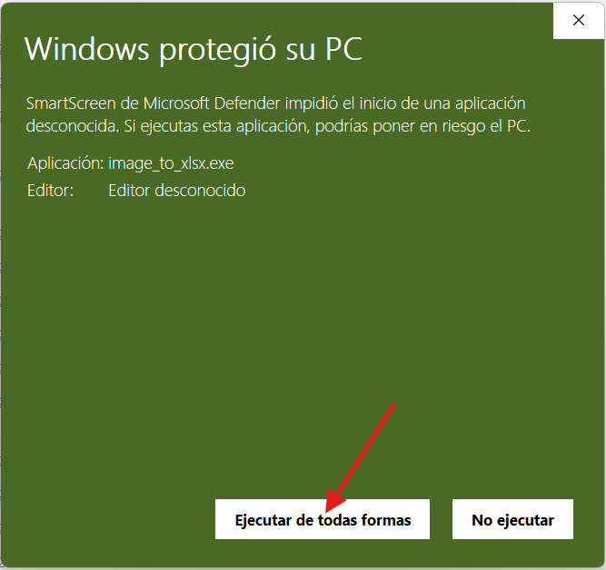
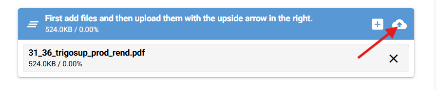
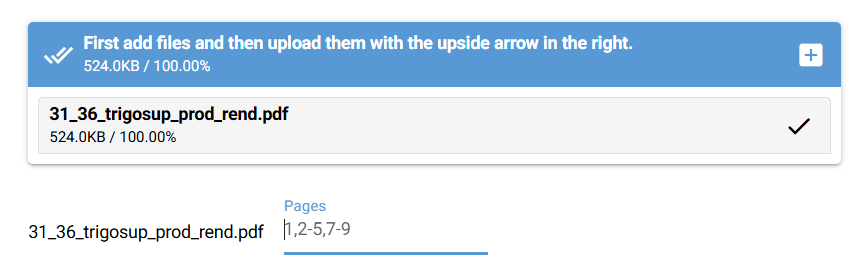

The following are instructions for using the GUI (Graphical User Interface)
app. For now the direct executable is only available on Windows, though you
might want to try running the developer version yourself in other systems.
These instructions are then for Windows.

1. **Download the latest release**. Look at the
    [releases](https://github.com/lbm364dl/image-to-xlsx/releases) and pick
    one, preferably the latest one. In the assets section of the release page
    you must download and extract the `image-to-xlsx.zip` file. The zip
    extraction might take a while, but it will eventually finish.
    
2. Open the `image_to_xlsx.exe` program. **If it asks for permission to run,
    run anyway** (if you trust this program). It might be a prompt saying
    something like _Windows protected your PC_. Click _more info_ and
    _run anyway_. I think this shows up because of downloading from an unknown
    source but I'm not sure. 
    
    

    The app works in your browser. It will first open (and keep open) a Windows
    terminal, which is where the app runs, but it will open a tab in your
    browser, which is where you will actually use the tool. You might also be
    asked for something like **'network' permissions**. I'm not sure why this
    happens but you **should be fine even rejecting** these. When you're done
    and you want to close the app, you should close both the terminal window
    and the browser tab.
3. (Optional) Add AWS (Amazon Web Services) credentials. You will need this if
    you want to use the Amazon Textract method for table extraction, which
    is the most reliable one. If you are a collaborator of our 
    [WHEP project](https://github.com/eduaguilera/WHEP) you should have
    received credentials from us. Otherwise, you will need to figure out how
    to create your own AWS account and credentials through IAM. Once you have
    the credentials, you can add them directly in the app through the
    _Modify current AWS credentials_ section, and it's enough to do this the
    first time, or every time you want to use new credentials. It will ask for
    `AWS Access Key Id` and `AWS Secret Access Key` (which you should have) and
    `AWS region`, which you should also know (if coming from WHEP, this should
    be `eu-west-3`).
4. Enjoy using the tool. Below I leave some explanation of the different
    options it has available and how to upload some files and run an extraction.

When using the tool, the first option is **choosing an extraction method**. The
available methods are already briefly explained in the app. Again we stress
the fact that the most reliable option is the Textract one. The others might
give worse results (they are also not so well tested).

Then there are some options that you can use if you want:
- Image rotation: this is very experimental, might not be too reliable, but
    can sometimes be helpful. It can also be slow though.
- Split into multiple rows: sometimes the table recognition fails to see
    two different adjacent rows and instead recognizes them as a single one.
    If this option is enabled, the tool will try to split them again into two.
- Letter to digit substitution: it might reduce some manual work fixing some
    letter typos which we assume should be digits.
- Remove commas and dots: sometimes OCR gives bad results for commas and dots
    and it's actually easier to just remove them and input our own manually,
    especially if there is a quite constant number of decimal places in our
    tables. If that's the case and this option is enabled, it will show another
    one asking if we want to automatically write this decimal separator in all
    numeric cells (leave empty if you don't want the separator).

After choosing method and options, we must **upload the files**. Remember that
only PDFs and images (PNG, JPG) are accepted, and that you **first** have to
**choose files** and **then** manually **also click the upload button**. 

After that you will be asked for each PDF file if you want to specify a smaller
range of pages to process, in case you don't want to process all of them. The
ranges work like in other tools, i.e., you can include several ranges separated
by commas, and each range can be a single page number or an interval of start
and end page numbers separated by commas (e.g. `1,2-5,7-9`).

We **recommend not running** the extraction for a **lot of pages at the same
time**, because if something goes wrong, it will have to be run again. Also, if
the inputs are large (like trying to choose only a few pages from a large PDF),
you have an option to avoid including the input files in the output zip.
Otherwise, in the output zip there will be a subfolder for each input file,
which will also include the input file itself, just to have everything easily
accessible when having to review the results.

We can now click the **_extract tables_** button and wait. When the extraction is
done you will see a new **_download results_** button. As mentioned before, this
will download a zip file with the results, with one subfolder for each input
file. Each subfolder contains the input file (optionally), the Excel file
with the detected tables, and the Excel file with the detected footers (also
optionally, if running Textract method).

The **results Excel file** will have **one sheet for each detected table**, and
the sheet name will also include the page number (useful if you're using PDFs
as input files). Of course if the extraction is not perfect it might split
a table into more than one sheet if it wrongly recognized it as two tables.
There is also a **color coding** for each cell, indicating the **confidence**
of the detected text by the OCR (Optical Character Recognition). The color
legend is **explained in [this file](https://saco.csic.es/s/ESYzMcR9NWjWbrB)**.

The **outputs** will surely require a **human review** to fix mistakes and make
sure everything is correct, but should be a good help to reduce workload. If you
want to run more files after this, make sure to click the _clear file list_
button before adding new ones to start clean.

If something is **not working as expected**, try to close everything (both
terminal and browser tab) and start again. If it's still not working, **ask
developers for help**. You should check if there is some **error output in
your terminal**. If there is, please also share that to the developer.
